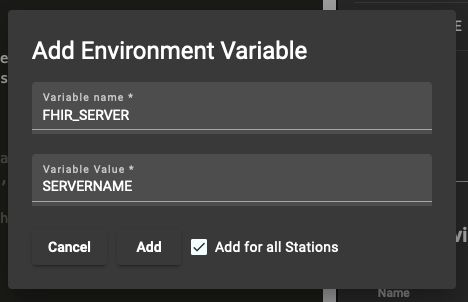

## Evaluation: BC use case

This folder contains all files that are needed to replicate the BC use case as described in the paper. Before trying to replicate the use case, please setup your development environment (backend, frontend, etc.) as described in the Readme.md in the /src folder.

After your local Playground instance is running successfully, you can execute the following to replicate the use case:

## 1. Insert the schema data into Blazegraph

1. Navigate to http://localhost:9999 and switch to the 'Update' tab
2. In the 'Type' dropdown below choose "**RDF Data**" and in the 'Format' dropdown choose "**Turtle**"
3. Paste the contents from **./schema.ttl** and press "Update".
4. Now your blazegraph DB has all the data to execute this use case

## 2. Setup a local FHIR server with the data

As stated in the paper, the BC use case was executed with (real) sample data. This data stems from the [Breast Cancer Wisconsin (Diagnostic) Data Set](https://www.kaggle.com/datasets/uciml/breast-cancer-wisconsin-data). Therefore, we first need to setup the data source using the following steps before executing the use case.

This setup follows the original use case paper by Welten et al.[^1] and requires one FHIR server. First, this server will be setup and then we will import the data. If you already have a FHIR server in place, you can skip step 2.1.

### 2.1 FHIR server setup

For setting up a FHIR server, we will use the server provided by [Samply](https://github.com/samply/blaze). To start a instance on your local machine, you can run the following docker command:
```
docker run -d -p XXXX:8080 -e BASE_URL=http://SERVERNAME:XXXX -v blaze-data:/app/data --name playground_bc_fhir samply/blaze:0.12
```
<p align="center">
(Please replace XXXX with a port that is available on your machine. Moreover, please replace SERVERNAME either with the IP address or name of the machine. This address is later needed in the playground to access the server.)
</p>


### 2.2 Upload use case data

To simplify the setup, we will upload all available data for the usecase to one FHIR server. We then use the analysis code to restrict certain stations to only access certain entries (see step 3). To upload the data from the [Breast Cancer Wisconsin (Diagnostic) Data Set](https://www.kaggle.com/datasets/uciml/breast-cancer-wisconsin-data) to the FHIR server, we transformed the data into FHIR resources according to the mechanism described by Mou at al.[^1]. These resources are provided in the 'Build-Files' folder as a JSON document. For uploading the data, we will use ```blazectl```, a tool that allows you to interact with a FHIR server from a CLI. Please execute the following steps to upload the data:

1. Install blazectl according to the [instructions in the repository](https://github.com/samply/blazectl/)
2. Check that blazectl is working by executing ```blazectl --version```. You should see the tool version printed to the screen
3. Upload the data to your FHIR server with the following command: ```blazectl --server http://SERVERNAME:XXXX/fhir upload ./Bundle-Files``` (Please replace SERVERNAME and XXXX with the data from step 2.1)
4. Check that the data has been uploaded by executing ```blazectl --server http://SERVERNAME:XXXX/fhir count-resources``` (Please replace SERVERNAME and XXXX with the data from step 2.1). You should see the following output:

``` text
Count all resources on http://SERVERNAME:XXXX/fhir ...

Condition                         :   569
Observation                       : 17070
Patient                           :   569
Specimen                          :  1707
-----------------------------------------
total                             : 19915
```

Now the preparations are completed and we can proceed with the use case execution.

## 3. Execute the use case

To execute the use case, do the following: 

1. Open your local Playground instance at http://localhost:4200
2. In the 'BC Orga', select the 'Breast Cancer Detection Dataset' for all six available data providers 
3. Click on 'Select Route' in the lower right corner and confirm the route
4. Wait for the environment to be created
5. Upload the file **./bc.zip** into the playground via the upload button in the upper left corner. This file contains all the source code needed to execute the use case. Moreover, we also provide one csv file for each station. This file indicates which patients of the dataset from step 2.2 should be analyzed at the respective station.
6. Switch to the 'Environment Variables' setting via the menu on the right side of the playground
7. Under 'Custom Environment Variables', click the 'Add Variable' Button for each of the following variables and enter the information. Please also check the 'Add for all Stations' checkbox before clicking on 'Add'.

| Variable Name | Value                 |
|---------------|-----------------------|
| FHIR_SERVER   | SERVERNAME (from 2.1) |
| FHIR_PORT     | XXXX (from 2.1)       |

Here is an example how to add a variable:


Now you can press **play** in the upper left corner of the playground to execute the use case.

## Adjusting analysis settings

If you want, you can adjust two settings for the use case execution:

1. Whether to generate synthetic data (default = False)
2. If synthetic data should be created, whether outliers (e.g. negative values) should be removed (default = True)

To change these settings, set the  ```GENERATE_SYNTHETIC_DATA``` or ```AUTOREMOVE``` environment variable to a desired boolean value via the 'Custom Environment Variables' setting described above. 

[^1]: [Welten, Sascha, et al. "Multi-Institutional Breast Cancer Detection Using a Secure On-Boarding Service for Distributed Analytics." Applied Sciences 12.9 (2022): 4336.](https://www.mdpi.com/2076-3417/12/9/4336)