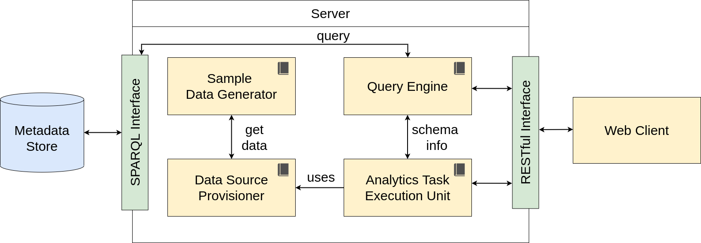

## Lib

The lib folder contains an implementation for the Architecture components. This includes the **Sample Data Generator**, **Query Engine**, **Data Source Provisioner** and **Analytics Task Execution Unit**.

This folder moreover contains the models that are used as interface between those components and the session manager that makes managing the user session easier for the other components.

The following gives an overview of the contained components (the ones inside the server):

## Plugin System

Both the Sample Data Generator and the Data Source Provisioner support plugins. Take a look in the respective subfolder for further information.